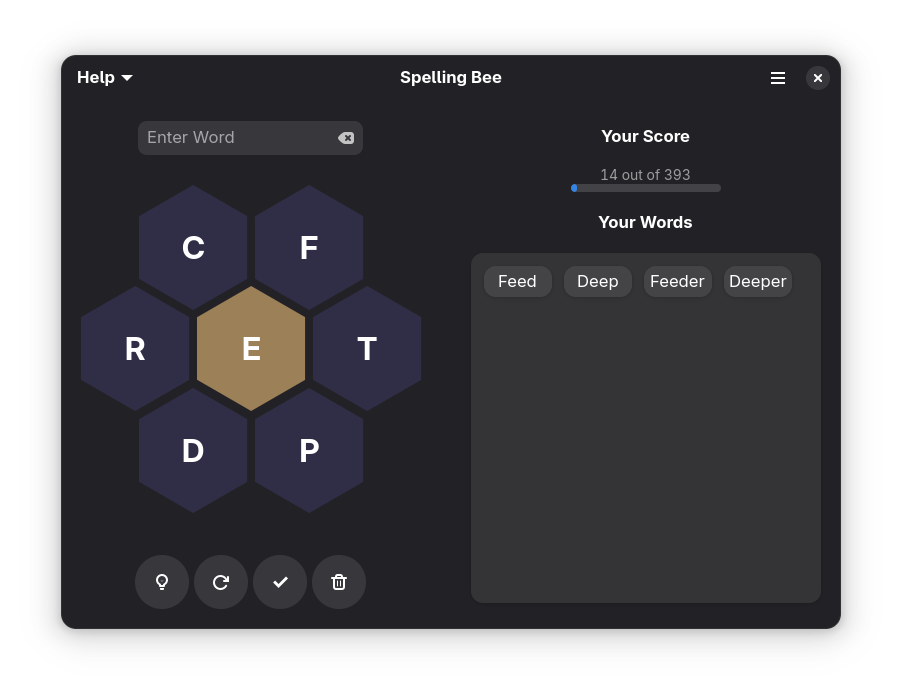

<!-- markdownlint-disable -->

  

<h1 align="center">Spelling Bee</h1>

<b>Enhance your English vocabulary while having fun</b>

  

  

  

<!-- markdownlint-enable -->
<!-- markdownlint-disable headings -->

Spelling Bee is a simple game that requires you to create words from the given letters.

 ## Main features

- Provides thousands of words
- You can play it offline
- It provides links to the meaning of words
- You can view puzzle history
- You can view your score
- Switch to dark, light, or system mode

## Contributing

If you find this app useful, do consider contributing. If you are wondering how,
you can contribute in the following ways:

- Star the project repository on GitHub
- Report bugs if you encounter some. There are probably a handful of them.
- You can also contribute code. If it is a bug fix, do open a pull request(PR). However,
if it is a new feature, first open an issue so that we discuss it before opening
a PR.

## Run project locally
 <!-- markdownlint-disable no-inline-html -->
1. Download [GNOME builder](https://flathub.org/apps/org.gnome.Builder). It's the
 fastest way to get up and running.
1. Use GNOME builder to clone this project to your local machine. The
<kbd>Clone Repository</kbd> button is at the bottom of the GNOME builder Welcome
 screen.
1. Use the <kbd>Shift</kbd> + <kbd>Ctrl</kbd> + <kbd>Space</kbd> keyboard
combination to run the project after opening it in GNOME builder. You can also
 use the <kbd>▶</kbd> button at the top.
 <!-- markdownlint-enable no-inline-html -->

## License

Spelling Bee is a [free software](https://www.gnu.org/philosophy/free-sw.html) and
will always be free. It is released under the terms of the
[GNU General Public License v3.0](./LICENSE).

## License

This project is [GPL-3.0 Licensed](./COPYING).

## Copyright

Copyright © 2025 [Joseph Mawa](https://github.com/josephmawa)
